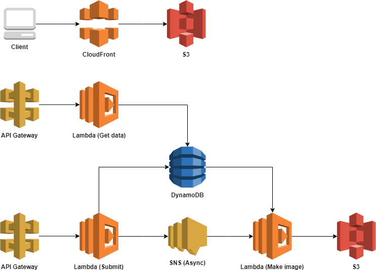

# Serverless project 2019
서버리스 웹 프로젝트 2019

## 환경
- AWS 계정
- python 3.7.4
- docker
- docker-compose

### 셋팅
파이썬3와 가상환경 설치
```bash
$ yum update -y
$ yum install python3 -y
$ pip3 install virtulenv
$ mkdir virutalenv directory, e.g. venv
$ virtualenv -p {python3_path} {env_name}
$ source {env_name}/bin/activate
$ pip3 install awscli
$ awscli configure
$ deactivate
```

## AWS 사용 서비스 분포도

- API Gateway
- CloudWatch
- CloudFront
- DynamoDB
- Lambda
- S3
- SNS
- IAM

## 아키텍처

---

## 작업내용
### Front-end
[프런트엔드 화면 구성 (./front-end)](./front-end)
- 작업완료도에 따라 다름
    1. [화면 작성](./front-end/step1)
    2. [API 연동 완료](./front-end/step2)
    3. [작업본 정리](./front-end/step3)

### Back-end
[백엔드기능 구현 (./back-end)](./back-end)
- API
    - GET : [get.py](./back-end/get.py)
    - POST : [post.py](./back-end/post.py)
- Make Image
    - GET : [make.py](./back-end/make.py)

---

## 레퍼런스
### Lambda
- [런타임](https://docs.aws.amazon.com/ko_kr/lambda/latest/dg/lambda-runtimes.html)
- [한도](https://docs.aws.amazon.com/ko_kr/lambda/latest/dg/limits.html)
- [계층](https://docs.aws.amazon.com/ko_kr/lambda/latest/dg/configuration-layers.html)

### DynamoDB
- [제한값](https://docs.aws.amazon.com/ko_kr/amazondynamodb/latest/developerguide/Limits.html)
- [핵심구성요소](https://docs.aws.amazon.com/ko_kr/amazondynamodb/latest/developerguide/HowItWorks.CoreComponents.html#HowItWorks.CoreComponents.TablesItemsAttributes)
- [읽기일관성](https://docs.aws.amazon.com/ko_kr/amazondynamodb/latest/developerguide/HowItWorks.ReadConsistency.html)

### ClodFront
- [캐싱기간관리](https://docs.aws.amazon.com/ko_kr/AmazonCloudFront/latest/DeveloperGuide/Expiration.html)
- [압축](https://docs.aws.amazon.com/ko_kr/AmazonCloudFront/latest/DeveloperGuide/ServingCompressedFiles.html)
- [한도](https://docs.aws.amazon.com/ko_kr/AmazonCloudFront/latest/DeveloperGuide/cloudfront-limits.html)
- [설정값](https://hidekuma.github.io/aws/cloudfront/cloudfront-settings/)

### API Gateway
- [매핑 모델](https://docs.aws.amazon.com/ko_kr/apigateway/latest/developerguide/models-mappings.html)
- [매핑 템플릿](https://docs.aws.amazon.com/ko_kr/apigateway/latest/developerguide/api-gateway-mapping-template-reference.html)

### S3
- [S3 데이터모델](https://hidekuma.github.io/aws/s3/s3-data-model/)
